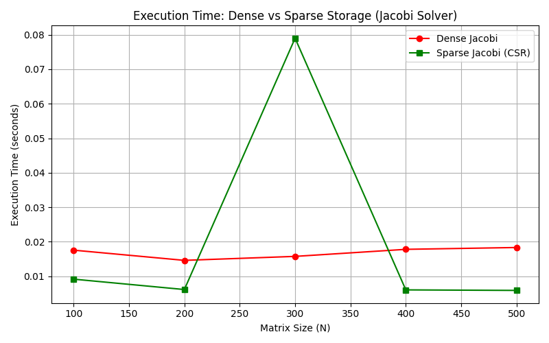
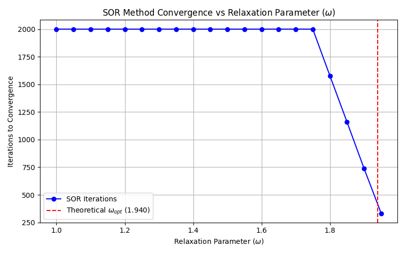

# Large-Scale Linear Systems Solvers

[](https://www.python.org/downloads/)
[](https://opensource.org/licenses/MIT)

This repository contains numerical implementations and benchmarks of iterative methods for solving large-scale systems of linear equations ($Ax = b$). 

Developed as part of the **SLGD (Large-Scale Linear Systems)** course in the **MAM5 (Applied Mathematics & Data Science)** engineering program at Polytech Nice Sophia.

---

## 📌 Overview

When solving high-dimensional linear systems, direct methods like LU decomposition or Gaussian elimination become computationally expensive ($O(N^3)$ complexity) and memory-intensive. Iterative solvers approximate the solution $x$ with controlled tolerance and significantly reduce memory usage when combined with **Sparse Matrix** storage.

### Implemented Methods:
1. **Jacobi Method** (Dense & Sparse CSR storage)
2. **Gauss-Seidel Method**
3. **Successive Over-Relaxation (SOR)** with parameter optimization ($\omega$)

---

## 📐 Mathematical Background

A system $Ax = b$ is split as $A = M - N$, leading to the iteration:
$$x^{(k+1)} = M^{-1} N x^{(k)} + M^{-1} b$$

Convergence is guaranteed if and only if the **spectral radius** of the iteration matrix satisfies:
$$\rho(M^{-1}N) < 1$$

### Solvers Comparison:
| Solver | Matrix Split $M$ | Convergence Speed | Notes |
| :--- | :--- | :--- | :--- |
| **Jacobi** | $D$ (Diagonal) | Slow | Fully parallelizable |
| **Gauss-Seidel** | $D + L$ (Lower triangular) | Faster than Jacobi | Sequential dependency |
| **SOR** | $\frac{1}{\omega}D + L$ | Fastest (if $\omega$ optimal) | Over-relaxation ($1 < \omega < 2$) |

---

## 📊 Performance Analysis & Benchmarks

### 1. Storage Impact: Dense vs Sparse CSR (Jacobi)
Using **Compressed Sparse Row (CSR)** matrix representations drastically speeds up computation for large tridiagonal matrices ($N \ge 1000$).



### 2. Optimal Relaxation Parameter ($\omega_{opt}$) for SOR
For a symmetric positive-definite tridiagonal matrix, the theoretical optimal relaxation factor is given by:
$$\omega_{opt} = \frac{2}{1 + \sqrt{1 - \rho(B_J)^2}}$$
where $\rho(B_J)$ is the spectral radius of the Jacobi iteration matrix.



---

## 🚀 Getting Started

### Prerequisites
- Python 3.8 or higher

### Installation
1. Clone the repository:
   ```bash
   git clone https://github.com/YOUR_USERNAME/Large-Scale-Linear-Systems-Solvers.git
   cd Large-Scale-Linear-Systems-Solvers
   ```
2. Install dependencies:
   ```bash
   pip install -r requirements.txt
   ```

### Execution
Run the benchmark script to execute all solvers, generate statistics, and recreate the visualization graphs:
```bash
python main.py
```

---

## 📁 Repository Structure

```text
├── assets/                  # Plots and images for documentation
├── src/
│   ├── solvers.py           # Core solver implementations (Jacobi, GS, SOR)
│   └── utils.py             # Matrix generation & spectral radius calculations
├── main.py                  # Entry point for benchmarking and plots
├── requirements.txt         # Required Python packages
└── README.md                # Project documentation
```
